<h1>Detection & Incident Response with Atomic Red Team</h1>


<h2>Description</h2>
Project consists of configuring a Windows Server with a Splunk Universal Forwarder to simulate endpoint telemetry for threat detection. Sysmon was installed to enhance event logging, and the Splunk instance was configured to receive and index logs in real time. Atomic Red Team test T1059.001 (Command and Scripting Interpreter: PowerShell) was executed to simulate adversary behavior. The resulting activity was identified in Splunk, where a detection rule was created, triggering automated notifications for response action.
<br />


<h2>Languages and Utilities Used</h2>

- <b>PowerShell</b> 
- <b>SPL</b>
- <b>Slack</b>
  
<h2>Environments Used </h2>

- <b>Windows Server 2022</b> (21H2)

<h2>Program walk-through:</h2>

<p align="center">
To begin I configured by Splunk instance to receive data from my Windows Server, by setting it to listen on port 9997: <br/>

<br />
<br />
I then created a new index and labeled it "wineventlog:  <br/>

<br />
<br />
From there, I navigated to the Splunk web page to download the Splunk Universal Forwarder for my system and begin installation: <br/>
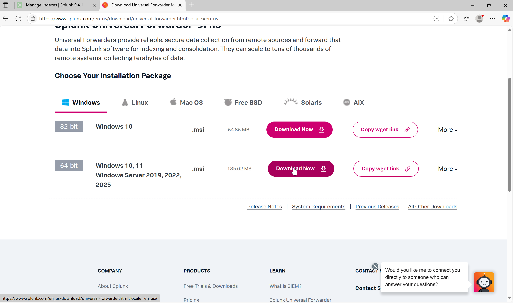
<br />
<br />
I specified my installation options, created my credentials for my Admin account,entered the IP of my deployment server as well as the default port and completed installation:  <br/>
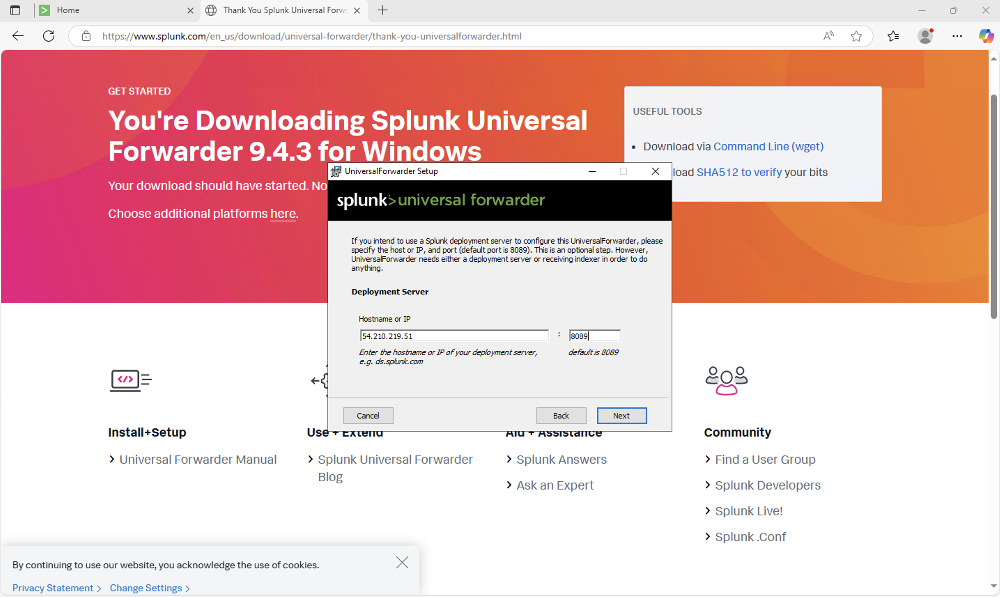
<br />
<br />
In my Splunk instance I chose the data ingestion method as forwarder, and configured. Below you can the name, the index and forwarder selected, as well as the event log to pull from:  <br/>

<br />
<br />
Before navigating back to my Windows Server, I installed the following add-ons within my Splunk instance. The Windows add-on includes predefined inputs to collect data from the Windows systems:  <br/>
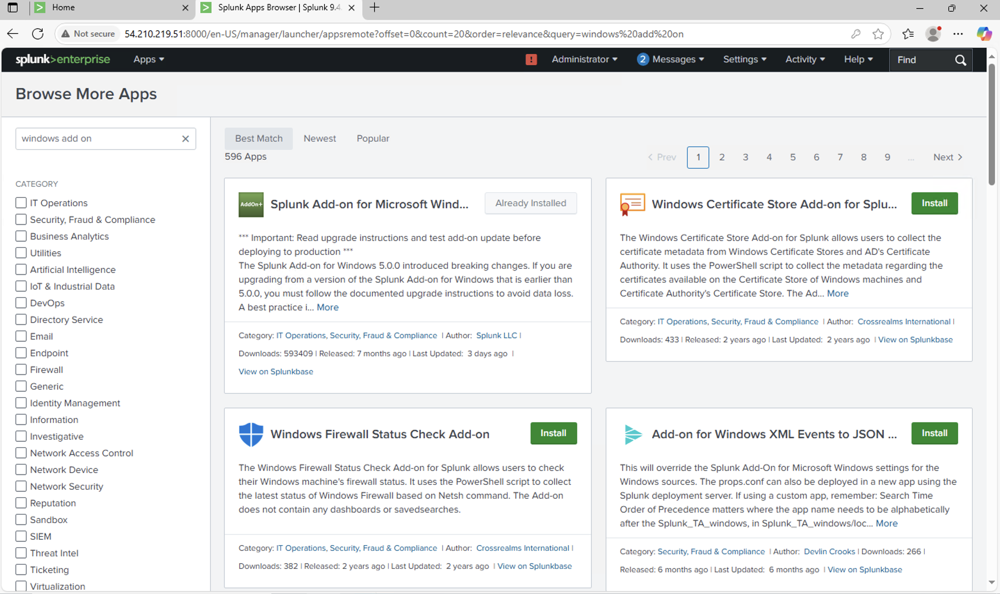
<br />
<br />
The Sysmon add-on provides continuous Sysmon-to-Splunk integration for real-time streaming of detections, events, incidents, and audit data:  <br/>
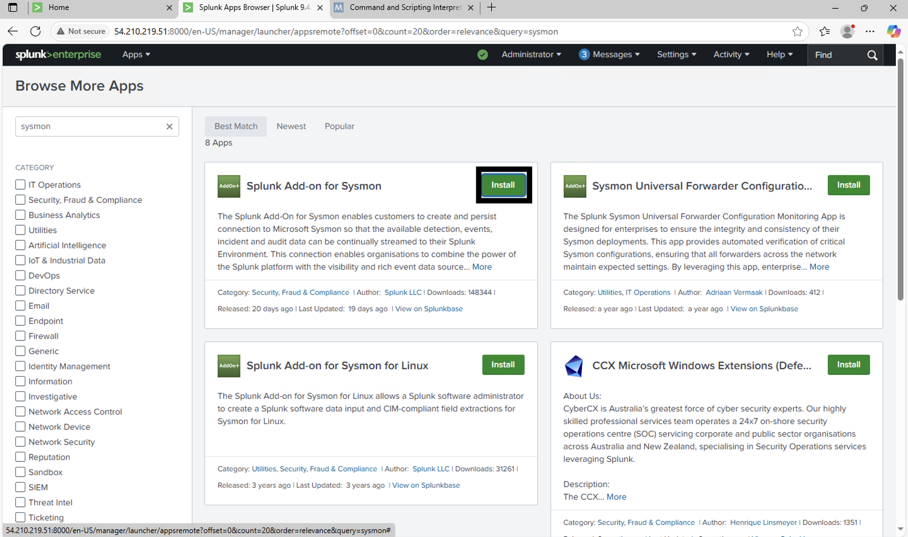
<br />
<br />
Navigated to MITRE webpage, found the specific Powershell technique I'd be executing and made note of commands to look for:  <br/>
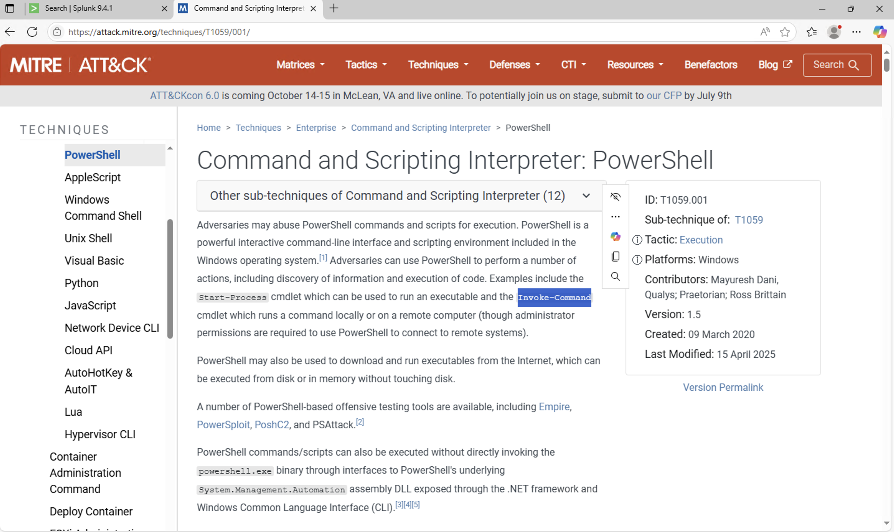
<br />
<br />
Installing Sysmon and accepting license on my Windows Server:  <br/>

<br />
<br />
Creating inputs.conf file:  <br/>
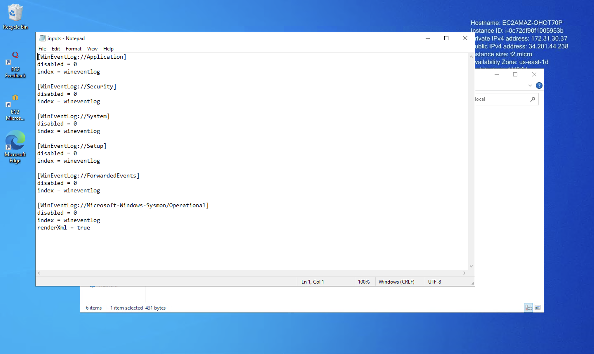
<br />
<br />
Output.conf file:  <br/>
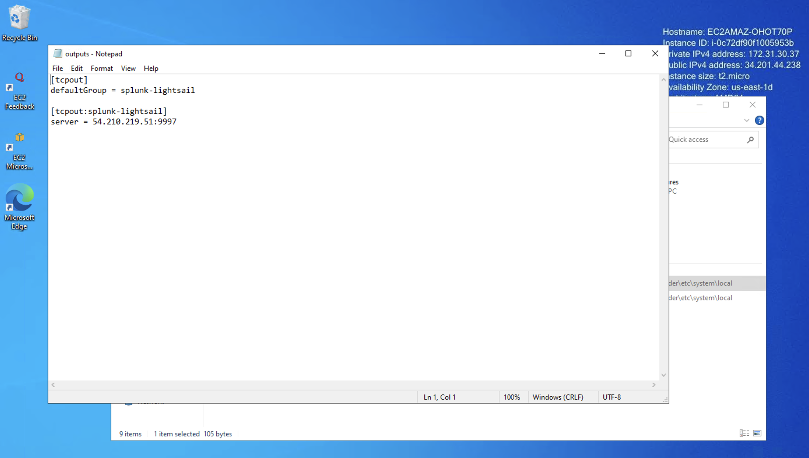
<br />
<br />
Turned off virus protection for the duration of this lab to avoid interference with the simulated attack techniques:  <br/>

<br />
<br />
I then navigated to the Atomic Red Team web page and installed the execution framework. Once installed I ran show details for T1059.001 to gather more information:  <br/>

<br />
<br />
Running the atomic tests 1-3:  <br/>
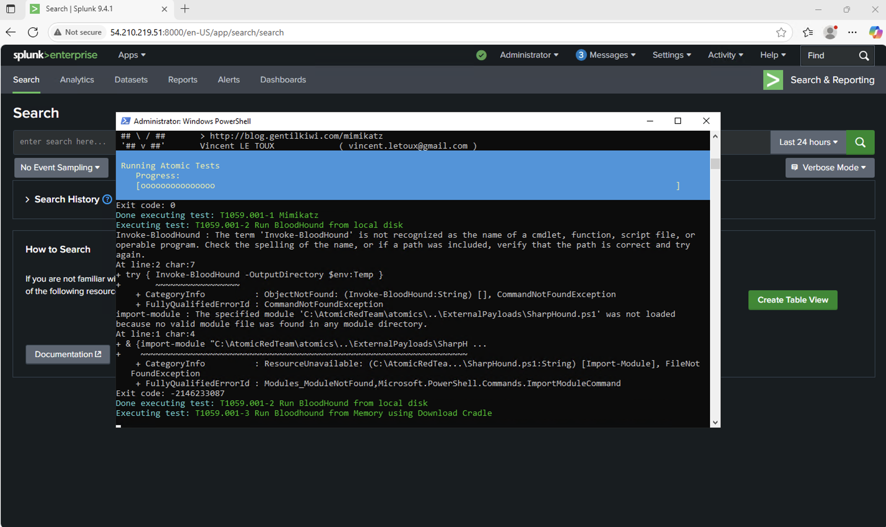
<br />
<br />
Inside Splunk, I navigated to the wineventlog index and began to investigate the data that came through:  <br/>

<br />
<br />
There were specific commands that I wanted to find so I ran the search command to see what results it would bring back. I navigated to the command field and found the simulated Powershell attack:  <br/>
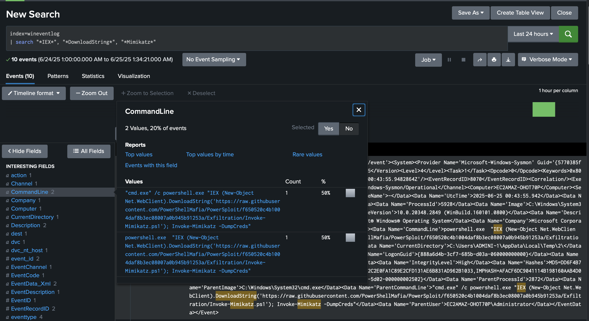
<br />
<br />
I created the following SPL query, searching the command line for the following: IEX, DownloadString, and Mimikatz and putting that information in a table by the host, user, parent image(process that launched the executable), command line and image(executable that was launched):  <br/>

<br />
<br />
From the table I found critical information such as Bloodhound, Sharphound and Invoke-Mimikatz-Dumpcreds. So I built an alert to test if my query could detect this attack:  <br/>
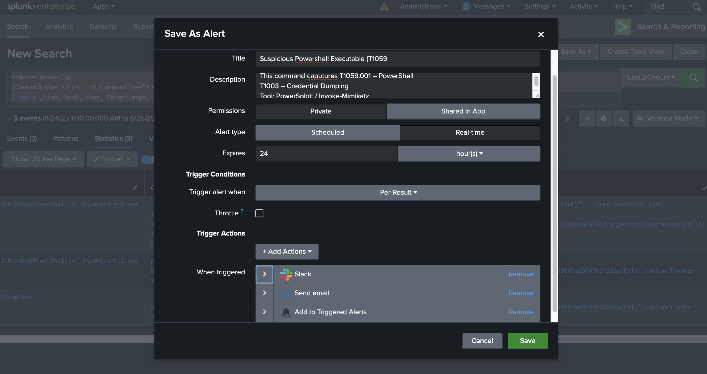
<br />
<br />
I ran the Atomic Test again and my alert triggered successfully:  <br/>

<br />
<br />
With the successful trigger of my alert I also recieved Slack notifications confirming that end-to-end functionality for response automation:  <br/>
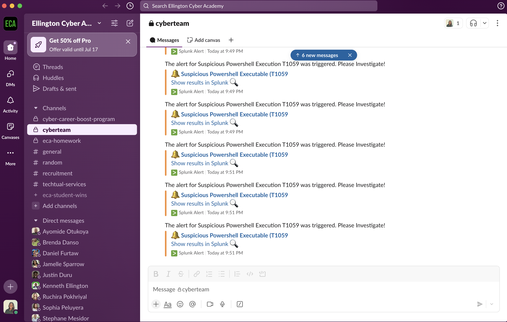
</p>

<!--
 ```diff
- text in red
+ text in green
! text in orange
# text in gray
@@ text in purple (and bold)@@
```
--!>
